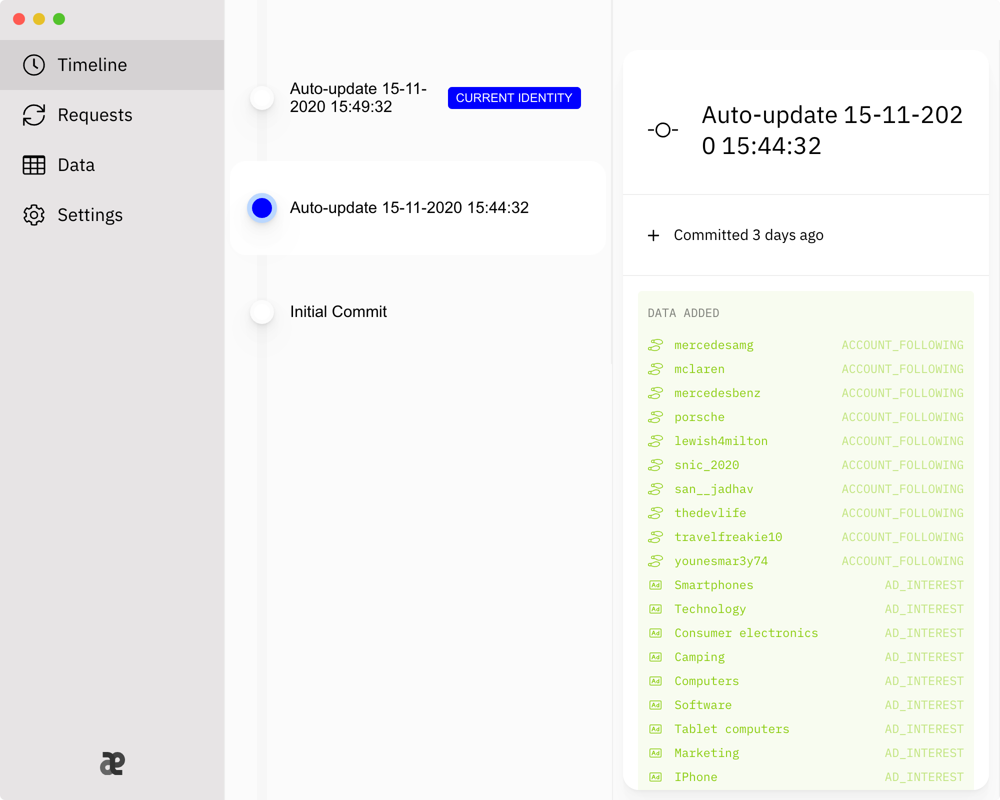

<a href="https://aeon.technology"></a>

<p align="center">
    <em>📡 Scan the internet for your personal information and modify or remove it</em>
</p>

<br />

<div align="center">
    
    
    
    <a href="https://docs.aeon.technology"></a>
</div>

<br />
<br />

# What is Aeon?
📡&nbsp; Ever wondered what personal information is scattered around the internet? Aeon scans popuplar platforms for your personal information and (*almost*) automatically retrieves it.

👀&nbsp; Use Aeon to download, archive and visualise your personal information. 

❌&nbsp; Don't agree with the data Facebook (or another platform) knows about you? Generate a request for modification or deletion with the click of a button!

<br />
<p align="center">
    
</p>
<br />

# Installing Aeon
<svg width="285" height="50" viewBox="0 0 285 50" fill="none" xmlns="http://www.w3.org/2000/svg">
<path d="M21.544 32L22.7457 28.5355H27.8594L29.0547 32H31.1513L26.4403 18.9091H24.1584L19.4474 32H21.544ZM23.321 26.8736L25.2514 21.2869H25.3537L27.2841 26.8736H23.321ZM40.057 22.1818H38.0051L35.525 29.7372H35.4228L32.9363 22.1818H30.8844L34.4512 32H36.4966L40.057 22.1818ZM44.4116 32.2173C46.0352 32.2173 46.9492 31.3928 47.3136 30.6577H47.3903V32H49.2567V25.4801C49.2567 22.6229 47.0067 22.054 45.4471 22.054C43.6701 22.054 42.0337 22.7699 41.3945 24.5597L43.1907 24.9688C43.4719 24.272 44.1879 23.6009 45.4727 23.6009C46.7063 23.6009 47.3391 24.2464 47.3391 25.3587V25.4034C47.3391 26.1001 46.6232 26.0874 44.859 26.2919C42.9989 26.5092 41.0941 26.995 41.0941 29.2259C41.0941 31.1562 42.5451 32.2173 44.4116 32.2173ZM44.8271 30.6832C43.7468 30.6832 42.967 30.1974 42.967 29.2514C42.967 28.2287 43.8746 27.8643 44.9805 27.7173C45.6005 27.6342 47.0707 27.468 47.3455 27.1932V28.4588C47.3455 29.6222 46.4187 30.6832 44.8271 30.6832ZM51.8024 32H53.7136V22.1818H51.8024V32ZM52.7676 20.6669C53.426 20.6669 53.9757 20.1555 53.9757 19.5291C53.9757 18.9027 53.426 18.3849 52.7676 18.3849C52.1028 18.3849 51.5595 18.9027 51.5595 19.5291C51.5595 20.1555 52.1028 20.6669 52.7676 20.6669ZM58.196 18.9091H56.2848V32H58.196V18.9091ZM63.6245 32.2173C65.248 32.2173 66.1621 31.3928 66.5265 30.6577H66.6032V32H68.4696V25.4801C68.4696 22.6229 66.2196 22.054 64.66 22.054C62.883 22.054 61.2466 22.7699 60.6074 24.5597L62.4036 24.9688C62.6848 24.272 63.4007 23.6009 64.6855 23.6009C65.9192 23.6009 66.552 24.2464 66.552 25.3587V25.4034C66.552 26.1001 65.8361 26.0874 64.0719 26.2919C62.2118 26.5092 60.307 26.995 60.307 29.2259C60.307 31.1562 61.758 32.2173 63.6245 32.2173ZM64.04 30.6832C62.9597 30.6832 62.1799 30.1974 62.1799 29.2514C62.1799 28.2287 63.0875 27.8643 64.1934 27.7173C64.8134 27.6342 66.2836 27.468 66.5584 27.1932V28.4588C66.5584 29.6222 65.6316 30.6832 64.04 30.6832ZM71.1687 32H73.0352V30.4723H73.195C73.5401 31.0987 74.2433 32.1918 76.033 32.1918C78.4109 32.1918 80.1367 30.2869 80.1367 27.1101C80.1367 23.9268 78.3853 22.054 76.0138 22.054C74.1921 22.054 73.5337 23.1662 73.195 23.7734H73.0799V18.9091H71.1687V32ZM73.0415 27.0909C73.0415 25.0391 73.9364 23.6776 75.6048 23.6776C77.337 23.6776 78.2063 25.1413 78.2063 27.0909C78.2063 29.0597 77.3114 30.5618 75.6048 30.5618C73.962 30.5618 73.0415 29.1555 73.0415 27.0909ZM84.1941 18.9091H82.2828V32H84.1941V18.9091ZM90.9968 32.1982C93.1381 32.1982 94.6531 31.1435 95.0877 29.5455L93.2788 29.2195C92.9336 30.1463 92.1026 30.6193 91.016 30.6193C89.3796 30.6193 88.2802 29.5582 88.229 27.6662H95.2092V26.9886C95.2092 23.4411 93.087 22.054 90.8626 22.054C88.1268 22.054 86.3242 24.1378 86.3242 27.1548C86.3242 30.2038 88.1012 32.1982 90.9968 32.1982ZM88.2354 26.2344C88.3121 24.8409 89.3221 23.6328 90.8754 23.6328C92.3583 23.6328 93.3299 24.7322 93.3363 26.2344H88.2354ZM106.766 22.1818H104.65V21.2997C104.65 20.4304 105.008 19.9574 105.941 19.9574C106.338 19.9574 106.619 20.0469 106.798 20.1044L107.245 18.5575C106.977 18.4553 106.421 18.2955 105.647 18.2955C104.094 18.2955 102.733 19.2031 102.733 21.044V22.1818H101.218V23.7159H102.733V32H104.65V23.7159H106.766V22.1818ZM112.487 32.1982C115.255 32.1982 117.064 30.1719 117.064 27.1357C117.064 24.0803 115.255 22.054 112.487 22.054C109.719 22.054 107.91 24.0803 107.91 27.1357C107.91 30.1719 109.719 32.1982 112.487 32.1982ZM112.493 30.5938C110.684 30.5938 109.841 29.0149 109.841 27.1293C109.841 25.25 110.684 23.652 112.493 23.652C114.289 23.652 115.133 25.25 115.133 27.1293C115.133 29.0149 114.289 30.5938 112.493 30.5938ZM119.197 32H121.108V26.0043C121.108 24.7195 122.099 23.7926 123.454 23.7926C123.85 23.7926 124.298 23.8629 124.451 23.9077V22.0795C124.259 22.054 123.882 22.0348 123.639 22.0348C122.489 22.0348 121.504 22.6868 121.146 23.7415H121.044V22.1818H119.197V32Z" fill="currentColor"/>
<path d="M172.18 26.707C172.18 25.4062 172.777 24.457 173.938 23.7188C173.27 22.7695 172.285 22.2773 170.984 22.1719C169.719 22.0664 168.348 22.875 167.855 22.875C167.328 22.875 166.133 22.207 165.184 22.207C163.215 22.2422 161.141 23.7539 161.141 26.8828C161.141 27.7969 161.281 28.7461 161.633 29.7305C162.09 31.0312 163.707 34.1953 165.395 34.125C166.273 34.125 166.906 33.4922 168.066 33.4922C169.191 33.4922 169.754 34.125 170.738 34.125C172.461 34.125 173.938 31.2422 174.359 29.9414C172.074 28.8516 172.18 26.7773 172.18 26.707ZM170.211 20.9414C171.16 19.8164 171.055 18.7617 171.055 18.375C170.211 18.4453 169.227 18.9727 168.664 19.6055C168.031 20.3086 167.68 21.1875 167.75 22.1367C168.664 22.207 169.508 21.75 170.211 20.9414Z" fill="currentColor"/>
<path d="M135 20.5547V25.8984H141.434V19.6758L135 20.5547ZM135 31.9805L141.434 32.8594V26.707H135V31.9805ZM142.137 32.9648L150.75 34.125V26.707H142.137V32.9648ZM142.137 19.5703V25.8984H150.75V18.375L142.137 19.5703Z" fill="currentColor"/>
<path d="M193.719 17.5312C188.902 17.5312 185 21.4336 185 26.25C185 31.0664 188.902 34.9688 193.719 34.9688C198.535 34.9688 202.438 31.0664 202.438 26.25C202.438 21.4336 198.535 17.5312 193.719 17.5312ZM195.547 20.8008C195.863 20.2734 196.566 20.0977 197.094 20.4141C197.621 20.7305 197.797 21.3984 197.48 21.9258C197.199 22.4883 196.496 22.6641 195.969 22.3477C195.441 22.0312 195.23 21.3633 195.547 20.8008ZM188.059 27.375C187.426 27.375 186.934 26.8828 186.934 26.25C186.934 25.6523 187.426 25.1602 188.059 25.1602C188.691 25.1602 189.184 25.6523 189.184 26.25C189.184 26.8828 188.691 27.375 188.059 27.375ZM189.043 27.4805C189.816 26.8828 189.816 25.6875 189.043 25.0547C189.359 23.8945 190.062 22.9102 191.047 22.2422L191.855 23.6484C190.062 24.9141 190.062 27.6211 191.855 28.8867L191.047 30.2578C190.062 29.625 189.359 28.6406 189.043 27.4805ZM197.094 32.1211C196.531 32.4375 195.863 32.2617 195.547 31.6992C195.23 31.1719 195.441 30.5039 195.969 30.1875C196.496 29.8711 197.199 30.0469 197.48 30.6094C197.797 31.1367 197.621 31.8047 197.094 32.1211ZM197.094 29.6953C196.145 29.3086 195.125 29.9062 194.984 30.9258C194.773 30.9609 193.262 31.418 191.574 30.5742L192.348 29.168C194.352 30.082 196.707 28.7461 196.883 26.5664H198.5C198.43 27.7969 197.902 28.8867 197.094 29.6953ZM196.883 25.9688C196.707 23.7891 194.387 22.418 192.348 23.3672L191.574 21.9609C193.262 21.1172 194.773 21.5742 194.949 21.6094C195.125 22.6289 196.145 23.2266 197.094 22.8398C197.902 23.6484 198.43 24.7383 198.5 25.9688H196.883Z" fill="currentColor"/>
<path d="M220.91 18.375C216.551 18.375 213 21.8906 213 26.25V32.2266C212.965 32.2266 212.965 32.2266 212.965 32.2617C212.965 33.2812 213.844 34.125 214.863 34.125H220.84C225.199 34.1602 228.75 30.6445 228.75 26.2852C228.75 21.9258 225.234 18.4102 220.91 18.375ZM226.852 23.9297L224.707 21.7148C224.777 21.5391 224.812 21.3984 224.812 21.2227V21.1523L226.781 23.1211C226.816 23.4023 226.852 23.6484 226.852 23.9297ZM224.637 20.5898C225.586 21.0117 226.324 21.8203 226.676 22.8398L224.777 20.9062C224.742 20.8008 224.672 20.6953 224.637 20.5898ZM217.148 25.9688C217.043 26.0742 216.938 26.2148 216.867 26.3555L216.551 26.0742C216.762 26.0039 216.938 25.9688 217.148 25.9688ZM216.41 26.1094L216.797 26.5312L216.762 26.8125C216.762 26.9531 216.797 27.0938 216.867 27.2344L215.918 26.2852C216.059 26.2148 216.234 26.1445 216.41 26.1094ZM215.742 26.3555L217.113 27.7266C216.938 27.7617 216.762 27.7969 216.586 27.8672L215.355 26.6016C215.496 26.5312 215.602 26.4258 215.742 26.3555ZM215.215 26.707L216.445 27.9727C216.34 28.043 216.199 28.1484 216.094 28.2539L214.863 27.0234C214.969 26.918 215.074 26.8125 215.215 26.707ZM214.758 27.1289L215.988 28.3594C215.883 28.5 215.777 28.6406 215.707 28.7812L214.441 27.5156C214.547 27.375 214.652 27.2695 214.758 27.1289ZM214.371 27.6562L215.637 28.9219C215.566 29.0977 215.531 29.2734 215.531 29.4492L214.125 28.0781C214.195 27.9375 214.266 27.7969 214.371 27.6562ZM214.055 28.2188L215.496 29.6953C215.531 30.0117 215.602 30.3281 215.742 30.6094L213.879 28.7109C213.949 28.5703 213.984 28.3945 214.055 28.2188ZM213.773 29.7305L215.953 31.9102C215.883 32.0508 215.812 32.2266 215.812 32.4023V32.4727L213.879 30.5039C213.809 30.2578 213.773 30.0117 213.773 29.7305ZM213.949 30.8203L215.883 32.7188C215.918 32.8594 215.953 32.9648 216.023 33.0352C215.039 32.6484 214.301 31.8047 213.949 30.8203ZM213.773 29.5195C213.773 29.3086 213.809 29.0977 213.844 28.9219L216.375 31.4531C216.27 31.5586 216.129 31.6289 216.059 31.7695L213.773 29.5195ZM222.668 27.6914H221.191V29.6602C221.191 32.0859 218.906 33.7383 216.762 33.2812C216.551 33.2812 216.059 32.9648 216.059 32.4023C216.059 31.9453 216.445 31.5586 216.938 31.5586C217.148 31.5586 217.148 31.5938 217.465 31.5938C218.555 31.5938 219.434 30.7148 219.434 29.6602L219.469 28.0078C219.469 27.832 219.293 27.6914 219.152 27.6914L217.957 27.6562C216.797 27.6562 216.832 25.9336 217.957 25.9336H219.469V23.9648C219.469 21.9258 221.121 20.2734 223.16 20.2734C223.195 20.2734 223.195 20.2734 223.195 20.2734C223.441 20.2734 223.652 20.3086 223.898 20.3789C224.285 20.4141 224.602 20.7656 224.602 21.2227C224.602 21.75 224.074 22.1719 223.512 22.0312C222.562 21.8555 221.191 22.5586 221.191 23.9648V25.6172C221.191 25.793 221.332 25.9336 221.508 25.9336H222.703C223.828 25.9688 223.828 27.6914 222.668 27.6914ZM223.512 27.6914C223.617 27.5508 223.723 27.4102 223.793 27.2695L224.074 27.5859C223.898 27.6211 223.688 27.6562 223.512 27.6914ZM224.25 27.5156L223.828 27.0938L223.863 26.8125C223.863 26.6719 223.828 26.5312 223.793 26.3906L224.742 27.3398C224.566 27.4102 224.426 27.4805 224.25 27.5156ZM224.883 27.2695L223.547 25.9336C223.723 25.8633 223.898 25.8281 224.039 25.7578L225.305 27.0234C225.164 27.0938 225.023 27.1992 224.883 27.2695ZM225.41 26.918L224.18 25.6875C224.32 25.582 224.426 25.4766 224.566 25.3711L225.797 26.6016C225.656 26.707 225.551 26.8125 225.41 26.918ZM225.902 26.4961L224.672 25.2656C224.777 25.125 224.848 25.0195 224.918 24.8438L226.184 26.1094C226.078 26.25 226.008 26.3906 225.902 26.4961ZM226.289 26.0039L224.988 24.7031C225.059 24.5273 225.094 24.3516 225.129 24.1758L226.5 25.582C226.43 25.7227 226.359 25.8633 226.289 26.0039ZM226.746 24.9141C226.711 25.0898 226.641 25.2305 226.57 25.4062L225.129 23.9297C225.129 23.6133 225.023 23.2969 224.883 23.0156L226.746 24.9141ZM226.781 24.7031L224.25 22.1719C224.391 22.1016 224.496 21.9961 224.602 21.8555L226.852 24.1055C226.852 24.3164 226.816 24.5273 226.781 24.7031Z" fill="currentColor"/>
<path d="M249.16 20.6953H247.578V24.4922L250.285 21.8203L249.16 20.6953ZM243.465 21.8203L246.137 24.4922V20.6953H244.555L243.465 21.8203ZM244.906 20.3438H246.488V24.8438L246.875 25.2305L247.262 24.8438V20.3438H248.809L246.875 18.375L244.906 20.3438ZM245.82 26.25L245.469 25.8633H240.934V24.3164L239 26.25L240.934 28.2188V26.6367H245.469L245.82 26.25ZM248.633 25.5117H252.43V23.9648L251.305 22.8398L248.633 25.5117ZM254.715 26.25L252.781 24.3164V25.8633H248.281L247.895 26.25L248.281 26.6367H252.781V28.2188L254.715 26.25ZM241.285 23.4727L242.41 22.3477L245.609 25.5117H246.137V24.9844L242.973 21.8203L244.062 20.6953H241.285V23.4727ZM252.43 20.6953H249.652L250.777 21.8203L247.578 24.9844V25.5117H248.141L251.305 22.3477L252.43 23.4727V20.6953ZM246.137 31.8047V28.0078L243.465 30.7148L244.555 31.8047H246.137ZM241.285 25.5117H245.117L242.41 22.8398L241.285 23.9648V25.5117ZM252.43 29.0625L251.305 30.1523L248.141 26.9883H247.578V27.5156L250.777 30.7148L249.652 31.8047H252.43V29.0625ZM252.43 26.9883H248.633L251.305 29.6602L252.43 28.5703V26.9883ZM250.285 30.7148L247.578 28.0078V31.8047H249.16L250.285 30.7148ZM242.41 29.6602L245.117 26.9883H241.285V28.5703L242.41 29.6602ZM248.809 32.1562H247.262V27.6562L246.875 27.3047L246.488 27.6562V32.1562H244.906L246.875 34.125L248.809 32.1562ZM242.973 30.7148L246.137 27.5156V26.9883H245.609L242.41 30.1523L241.285 29.0625V31.8047H244.062L242.973 30.7148Z" fill="currentColor"/>
</svg>

Aeon is available for Windows, macOS, apt and yum! Download the application here and follow the instructions on [the download page](https://aeon.technology/download).

[](https://aeon.technology/download)

Not sure how to start using Aeon? Follow the [Getting Started guide](https://docs.aeon.technology/using-aeon/getting-started) for detailed instructions.

# How does it work?
All companies worldwide are required to offer you access to all data they retain about you. But most of the time, this process is hard, convoluted, slow or all three at once! Aeon has rules for each platform that make requesting your personal information just a couple of clicks!

<p align="center">
    
</p>

The resulting data is downloaded on your local computer for safekeeping. Often, data is formatted in machine-readable formats such as JSON and CSV. To make it easier to digest your personal information, Aeon visualises it for you.

<p align="center">
    
</p>

Companies are not only required to grant access, they must respect your wishes too. This means you can require them to delete or modify the personal information they have. Aeon contains a generator for data subject rights emails, that help you take control of your personal data.

<p align="center">
    
</p>

# Supported Platforms
<svg width="363" height="50" viewBox="0 0 363 50" fill="none" xmlns="http://www.w3.org/2000/svg">
<path d="M31.3111 23.1662C30.8636 20.3665 28.6712 18.7301 25.9034 18.7301C22.5156 18.7301 20.0163 21.2678 20.0163 25.4545C20.0163 29.6413 22.5028 32.179 25.9034 32.179C28.7798 32.179 30.8828 30.3764 31.3111 27.7876L29.3168 27.7812C28.978 29.456 27.5717 30.3764 25.9162 30.3764C23.6726 30.3764 21.9787 28.657 21.9787 25.4545C21.9787 22.2777 23.6662 20.5327 25.9226 20.5327C27.5909 20.5327 28.9908 21.4723 29.3168 23.1662H31.3111ZM39.7406 27.9283C39.747 29.5966 38.5069 30.3892 37.4331 30.3892C36.2505 30.3892 35.4324 29.5327 35.4324 28.1967V22.1818H33.5211V28.4268C33.5211 30.8622 34.8571 32.1278 36.7427 32.1278C38.2193 32.1278 39.2228 31.348 39.6767 30.2997H39.7789V32H41.6582V22.1818H39.7406V27.9283ZM44.2262 32H46.1374V26.0043C46.1374 24.7195 47.1282 23.7926 48.4833 23.7926C48.8796 23.7926 49.3271 23.8629 49.4805 23.9077V22.0795C49.2887 22.054 48.9116 22.0348 48.6687 22.0348C47.5181 22.0348 46.5337 22.6868 46.1758 23.7415H46.0735V22.1818H44.2262V32ZM51.1344 32H53.0456V26.0043C53.0456 24.7195 54.0364 23.7926 55.3915 23.7926C55.7878 23.7926 56.2353 23.8629 56.3887 23.9077V22.0795C56.1969 22.054 55.8198 22.0348 55.5769 22.0348C54.4263 22.0348 53.4419 22.6868 53.084 23.7415H52.9817V22.1818H51.1344V32ZM61.9226 32.1982C64.0639 32.1982 65.5788 31.1435 66.0135 29.5455L64.2045 29.2195C63.8594 30.1463 63.0284 30.6193 61.9418 30.6193C60.3054 30.6193 59.206 29.5582 59.1548 27.6662H66.1349V26.9886C66.1349 23.4411 64.0128 22.054 61.7884 22.054C59.0526 22.054 57.25 24.1378 57.25 27.1548C57.25 30.2038 59.027 32.1982 61.9226 32.1982ZM59.1612 26.2344C59.2379 24.8409 60.2479 23.6328 61.8011 23.6328C63.2841 23.6328 64.2557 24.7322 64.2621 26.2344H59.1612ZM70.1667 26.1705C70.1667 24.6044 71.1255 23.7095 72.4551 23.7095C73.7527 23.7095 74.5389 24.5597 74.5389 25.9851V32H76.4501V25.755C76.4501 23.326 75.1142 22.054 73.1071 22.054C71.6305 22.054 70.6653 22.7379 70.2115 23.7798H70.09V22.1818H68.2555V32H70.1667V26.1705ZM83.5964 22.1818H81.5829V19.8295H79.6717V22.1818H78.2335V23.7159H79.6717V29.5135C79.6653 31.2969 81.0268 32.1598 82.5353 32.1278C83.1426 32.1214 83.5517 32.0064 83.7754 31.9233L83.4302 30.3445C83.3024 30.37 83.0659 30.4276 82.7591 30.4276C82.139 30.4276 81.5829 30.223 81.5829 29.1172V23.7159H83.5964V22.1818ZM87.8327 18.9091H85.9215V32H87.8327V18.9091ZM91.612 35.6818C93.1909 35.6818 94.188 34.8572 94.7569 33.3104L98.8159 22.201L96.7512 22.1818L94.2647 29.8011H94.1625L91.676 22.1818H89.6305L93.2228 32.1278L92.9863 32.7798C92.5005 34.0838 91.8166 34.1925 90.7683 33.9048L90.3081 35.4709C90.5382 35.5732 91.0368 35.6818 91.612 35.6818ZM112.738 24.5788C112.341 23.0511 111.146 22.054 109.024 22.054C106.806 22.054 105.233 23.2237 105.233 24.9624C105.233 26.3558 106.077 27.2827 107.918 27.6918L109.58 28.0561C110.526 28.267 110.967 28.6889 110.967 29.3026C110.967 30.0632 110.155 30.6577 108.903 30.6577C107.758 30.6577 107.023 30.1655 106.793 29.2003L104.946 29.4815C105.265 31.2202 106.71 32.1982 108.915 32.1982C111.287 32.1982 112.93 30.9389 112.93 29.1619C112.93 27.7749 112.047 26.9183 110.245 26.5028L108.685 26.1449C107.605 25.8892 107.138 25.5249 107.145 24.8601C107.138 24.1058 107.956 23.5689 109.043 23.5689C110.232 23.5689 110.782 24.2273 111.006 24.8857L112.738 24.5788ZM121.25 27.9283C121.257 29.5966 120.017 30.3892 118.943 30.3892C117.76 30.3892 116.942 29.5327 116.942 28.1967V22.1818H115.031V28.4268C115.031 30.8622 116.367 32.1278 118.252 32.1278C119.729 32.1278 120.733 31.348 121.186 30.2997H121.289V32H123.168V22.1818H121.25V27.9283ZM125.736 35.6818H127.647V30.4723H127.762C128.107 31.0987 128.811 32.1918 130.6 32.1918C132.978 32.1918 134.704 30.2869 134.704 27.1101C134.704 23.9268 132.953 22.054 130.581 22.054C128.759 22.054 128.101 23.1662 127.762 23.7734H127.602V22.1818H125.736V35.6818ZM127.609 27.0909C127.609 25.0391 128.504 23.6776 130.172 23.6776C131.904 23.6776 132.774 25.1413 132.774 27.0909C132.774 29.0597 131.879 30.5618 130.172 30.5618C128.529 30.5618 127.609 29.1555 127.609 27.0909ZM136.845 35.6818H138.757V30.4723H138.872C139.217 31.0987 139.92 32.1918 141.71 32.1918C144.088 32.1918 145.813 30.2869 145.813 27.1101C145.813 23.9268 144.062 22.054 141.691 22.054C139.869 22.054 139.21 23.1662 138.872 23.7734H138.712V22.1818H136.845V35.6818ZM138.718 27.0909C138.718 25.0391 139.613 23.6776 141.281 23.6776C143.014 23.6776 143.883 25.1413 143.883 27.0909C143.883 29.0597 142.988 30.5618 141.281 30.5618C139.639 30.5618 138.718 29.1555 138.718 27.0909ZM152.09 32.1982C154.858 32.1982 156.667 30.1719 156.667 27.1357C156.667 24.0803 154.858 22.054 152.09 22.054C149.323 22.054 147.514 24.0803 147.514 27.1357C147.514 30.1719 149.323 32.1982 152.09 32.1982ZM152.097 30.5938C150.288 30.5938 149.444 29.0149 149.444 27.1293C149.444 25.25 150.288 23.652 152.097 23.652C153.893 23.652 154.737 25.25 154.737 27.1293C154.737 29.0149 153.893 30.5938 152.097 30.5938ZM158.8 32H160.712V26.0043C160.712 24.7195 161.702 23.7926 163.058 23.7926C163.454 23.7926 163.901 23.8629 164.055 23.9077V22.0795C163.863 22.054 163.486 22.0348 163.243 22.0348C162.092 22.0348 161.108 22.6868 160.75 23.7415H160.648V22.1818H158.8V32ZM170.872 22.1818H168.858V19.8295H166.947V22.1818H165.509V23.7159H166.947V29.5135C166.941 31.2969 168.302 32.1598 169.811 32.1278C170.418 32.1214 170.827 32.0064 171.051 31.9233L170.706 30.3445C170.578 30.37 170.341 30.4276 170.034 30.4276C169.414 30.4276 168.858 30.223 168.858 29.1172V23.7159H170.872V22.1818ZM172.986 32H174.897V22.1818H172.986V32ZM173.951 20.6669C174.61 20.6669 175.159 20.1555 175.159 19.5291C175.159 18.9027 174.61 18.3849 173.951 18.3849C173.286 18.3849 172.743 18.9027 172.743 19.5291C172.743 20.1555 173.286 20.6669 173.951 20.6669ZM179.38 26.1705C179.38 24.6044 180.338 23.7095 181.668 23.7095C182.966 23.7095 183.752 24.5597 183.752 25.9851V32H185.663V25.755C185.663 23.326 184.327 22.054 182.32 22.054C180.843 22.054 179.878 22.7379 179.424 23.7798H179.303V22.1818H177.468V32H179.38V26.1705ZM192.343 35.8864C194.842 35.8864 196.772 34.7422 196.772 32.2173V22.1818H194.9V23.7734H194.759C194.42 23.1662 193.743 22.054 191.914 22.054C189.543 22.054 187.798 23.9268 187.798 27.0526C187.798 30.1847 189.581 31.853 191.902 31.853C193.704 31.853 194.401 30.8366 194.746 30.2102H194.868V32.1406C194.868 33.6811 193.813 34.3459 192.362 34.3459C190.77 34.3459 190.15 33.5469 189.811 32.9844L188.169 33.6619C188.686 34.8636 189.997 35.8864 192.343 35.8864ZM192.324 30.2678C190.617 30.2678 189.728 28.9574 189.728 27.027C189.728 25.1413 190.598 23.6776 192.324 23.6776C193.992 23.6776 194.887 25.0391 194.887 27.027C194.887 29.0533 193.973 30.2678 192.324 30.2678Z" fill="currentColor"/>
<path d="M230.719 25.25C230.719 20.4336 226.816 16.5312 222 16.5312C217.184 16.5312 213.281 20.4336 213.281 25.25C213.281 29.6094 216.445 33.2305 220.629 33.8633V27.7812H218.414V25.25H220.629V23.3516C220.629 21.1719 221.93 19.9414 223.898 19.9414C224.883 19.9414 225.867 20.1172 225.867 20.1172V22.2617H224.777C223.688 22.2617 223.336 22.9297 223.336 23.6328V25.25H225.762L225.375 27.7812H223.336V33.8633C227.52 33.2305 230.719 29.6094 230.719 25.25Z" fill="currentColor"/>
<path d="M255.625 17.375H242.09C241.492 17.375 241 17.9023 241 18.5352V32C241 32.6328 241.492 33.125 242.09 33.125H255.625C256.223 33.125 256.75 32.6328 256.75 32V18.5352C256.75 17.9023 256.223 17.375 255.625 17.375ZM245.746 30.875H243.426V23.3867H245.746V30.875ZM244.586 22.332C243.812 22.332 243.215 21.7344 243.215 20.9961C243.215 20.2578 243.812 19.625 244.586 19.625C245.324 19.625 245.922 20.2578 245.922 20.9961C245.922 21.7344 245.324 22.332 244.586 22.332ZM254.5 30.875H252.145V27.2188C252.145 26.375 252.145 25.25 250.949 25.25C249.719 25.25 249.543 26.1992 249.543 27.1836V30.875H247.223V23.3867H249.438V24.4062H249.473C249.789 23.8086 250.562 23.1758 251.688 23.1758C254.043 23.1758 254.5 24.7578 254.5 26.7617V30.875Z" fill="currentColor"/>
<path d="M275.719 16.5312C270.902 16.5312 267 20.4688 267 25.25C267 30.0664 270.902 33.9688 275.719 33.9688C280.5 33.9688 284.438 30.0664 284.438 25.25C284.438 20.4688 280.5 16.5312 275.719 16.5312ZM279.234 29.3633C279.094 29.3633 278.988 29.3281 278.883 29.2578C276.668 27.9219 274.137 27.8867 271.605 28.3789C271.465 28.4141 271.289 28.4844 271.184 28.4844C270.832 28.4844 270.621 28.2031 270.621 27.9219C270.621 27.5703 270.832 27.3945 271.113 27.3242C273.996 26.6914 276.914 26.7617 279.445 28.2383C279.656 28.3789 279.762 28.5195 279.762 28.8359C279.762 29.1523 279.516 29.3633 279.234 29.3633ZM280.184 27.0781C280.008 27.0781 279.867 26.9727 279.762 26.9375C277.547 25.6367 274.277 25.1094 271.359 25.8828C271.184 25.918 271.113 25.9883 270.938 25.9883C270.586 25.9883 270.27 25.6719 270.27 25.2852C270.27 24.9336 270.445 24.6875 270.797 24.582C271.781 24.3008 272.801 24.0898 274.242 24.0898C276.527 24.0898 278.742 24.6523 280.465 25.707C280.746 25.8477 280.887 26.0938 280.887 26.375C280.852 26.7617 280.57 27.0781 280.184 27.0781ZM281.273 24.4062C281.098 24.4062 280.992 24.3359 280.816 24.2656C278.32 22.7539 273.855 22.4023 270.938 23.2109C270.832 23.2461 270.656 23.3164 270.48 23.3164C270.023 23.3164 269.672 22.9297 269.672 22.4727C269.672 21.9805 269.988 21.7344 270.305 21.6289C271.535 21.2773 272.906 21.1016 274.418 21.1016C276.984 21.1016 279.691 21.6289 281.625 22.7891C281.906 22.9297 282.082 23.1406 282.082 23.5625C282.082 24.0547 281.695 24.4062 281.273 24.4062Z" fill="currentColor"/>
<path d="M302.875 21.207C300.625 21.207 298.832 23.0352 298.832 25.25C298.832 27.5 300.625 29.293 302.875 29.293C305.09 29.293 306.918 27.5 306.918 25.25C306.918 23.0352 305.09 21.207 302.875 21.207ZM302.875 27.8867C301.434 27.8867 300.238 26.7266 300.238 25.25C300.238 23.8086 301.398 22.6484 302.875 22.6484C304.316 22.6484 305.477 23.8086 305.477 25.25C305.477 26.7266 304.316 27.8867 302.875 27.8867ZM308.008 21.0664C308.008 20.5391 307.586 20.1172 307.059 20.1172C306.531 20.1172 306.109 20.5391 306.109 21.0664C306.109 21.5938 306.531 22.0156 307.059 22.0156C307.586 22.0156 308.008 21.5938 308.008 21.0664ZM310.68 22.0156C310.609 20.75 310.328 19.625 309.414 18.7109C308.5 17.7969 307.375 17.5156 306.109 17.4453C304.809 17.375 300.906 17.375 299.605 17.4453C298.34 17.5156 297.25 17.7969 296.301 18.7109C295.387 19.625 295.105 20.75 295.035 22.0156C294.965 23.3164 294.965 27.2188 295.035 28.5195C295.105 29.7852 295.387 30.875 296.301 31.8242C297.25 32.7383 298.34 33.0195 299.605 33.0898C300.906 33.1602 304.809 33.1602 306.109 33.0898C307.375 33.0195 308.5 32.7383 309.414 31.8242C310.328 30.875 310.609 29.7852 310.68 28.5195C310.75 27.2188 310.75 23.3164 310.68 22.0156ZM308.992 29.8906C308.746 30.5938 308.184 31.1211 307.516 31.4023C306.461 31.8242 304 31.7188 302.875 31.7188C301.715 31.7188 299.254 31.8242 298.234 31.4023C297.531 31.1211 297.004 30.5938 296.723 29.8906C296.301 28.8711 296.406 26.4102 296.406 25.25C296.406 24.125 296.301 21.6641 296.723 20.6094C297.004 19.9414 297.531 19.4141 298.234 19.1328C299.254 18.7109 301.715 18.8164 302.875 18.8164C304 18.8164 306.461 18.7109 307.516 19.1328C308.184 19.3789 308.711 19.9414 308.992 20.6094C309.414 21.6641 309.309 24.125 309.309 25.25C309.309 26.4102 309.414 28.8711 308.992 29.8906Z" fill="currentColor"/>
<path d="M334.219 23.4062H328.594V17.7812C328.594 17.6406 328.453 17.5 328.312 17.5H327.188C327.012 17.5 326.906 17.6406 326.906 17.7812V23.4062H321.281C321.105 23.4062 321 23.5469 321 23.6875V24.8125C321 24.9883 321.105 25.0938 321.281 25.0938H326.906V30.7188C326.906 30.8945 327.012 31 327.188 31H328.312C328.453 31 328.594 30.8945 328.594 30.7188V25.0938H334.219C334.359 25.0938 334.5 24.9883 334.5 24.8125V23.6875C334.5 23.5469 334.359 23.4062 334.219 23.4062Z" fill="currentColor"/>
</svg>


Aeon currently has native support for the following platforms:
* Facebook
* Instagram
* LinkedIn
* Spotify
* ...more coming soon

Want to see a particular platform added? [Create a GitHub issue](https://github.com/leinelissen/aeon/issues/new/choose) with the name of the particular provider. 

Want to help out with adding new platforms? Providers are easily defined with a Provider config. [Check out the documentation on Providers](https://docs.aeon.technology/extending-aeon/architecture/providers) to find out how they work. You can always create a Pull Request 

# Contributing
Aeon is being developed out in the open. Have an idea for a feature or a suggestion for a new provider? [Create a GitHub issue](https://github.com/leinelissen/aeon/issues/new/choose) and tag me (@leinelissen) if you need any help.

# Documentation
[](https://aeon.technology/download)

## Using Aeon
You can find the latest build of Aeon over at the [releases page](https://github.com/leinelissen/aeon/releases). There's builds for Windows, macOS and Linux. 

If you're feeling more adventurous, clone the repository and compile your own nightly build. The only dependency is [NodeJS](https://nodejs.org/en/download/package-manager/). Prepare the codebase and start a development build by running the following commands: 
```
npm install
npm start
```

## The Technical Stuff
Aeon is an [Electron](https://www.electronjs.org/)-based app, a mature platform for building JavaScript applications on the desktop. It is backed by a locally encrypted Git repository, made available through use of the excellent [nodegit](https://www.nodegit.org/) package.

A custom and modular back-end allows for tracking and retrieving data from multiple sources. This is done through retrieval from an API, asynchronous data requests or a combination of both. Parser logic then allows for extracting common data types from the resulting JSON or CSV. 