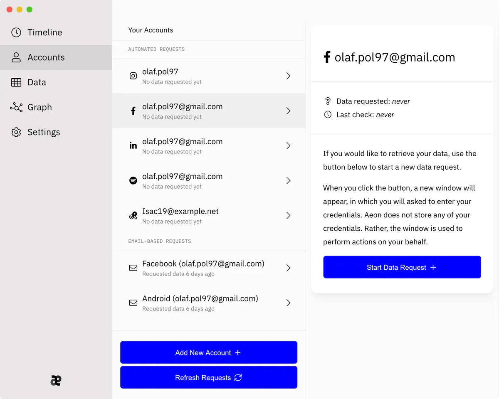

# Getting Started

Not sure how to get started with Aeon? Let us guide you through a few crucial steps to get started with requesting and owning your personal information!

Make sure you have installed Aeon first. If you don't know how to do so, [follow our guide](installation.md).

### Adding Accounts

First, find the accounts tab in the left menu.

Then, click the **Add New Account** button on the bottom of the screen.

A screen pops up, in which you can select a particular provided you would like to add. Click the platform of your choice (in this case Facebook) and the click the **Add New Facebook Account** button.&#x20;

Once you have clicked the button, a new window will pop up for logging in to the platform. Enter your credentials and click login.

Note: Aeon never stores your password, and all tokens that are kept on your behalf are stored locally and safely.

Your account is now set up, and you can feel free to add other accounts too!

### Starting Data Requests

If your accounts are all set up, you can browser through them in the Accounts tab.

&#x20;

&#x20;If you wish to retrieve data, select an account and click **Start Data Request**. You might need to enter your credentials again.

Data requests often take time. If your request is started successfully, you can kick it back and wait the hours / days it takes for the data request to complete. Aeon will let you know when the request is done.

### Completing Data Requests

Whenever a data request is finished, Aeon will let you know. You can complete a finished data request by going to the account and clicking **Complete Data Request**. Your data will be downloaded into Aeon.

### Visualising Data

Once your data is in Aeon, you can use its powerful visualisation tools to see what is going on with your data. Find the Graph tab on the left side, for instance.

The large blue balls represent platforms, the squares represent data types, and the small dots represent a single data point that was retrieved from the platform.

If you like, you can click an individual data point to inspect it:

### Removing Data

Feel like a platform should not be having one of your data points? You can automatically generate a request for deleting it. Click the **Delete This Data Point** button in any data visualisation to add it to data points slated for deleting.

&#x20;

.png>)

If you are sure you want to delete the data points, go to the **Erasure (1)** tab on the left-hand side.

Aeon will then display a list of datapoints that you have selected. Click **Remove 1 Data Point **to generate the request.

An email has been generated for each platform of which data is deleted. You will need to send this email yourself. Click **Send in E-mail Client** to open your default email client, so you can send the email.&#x20;
